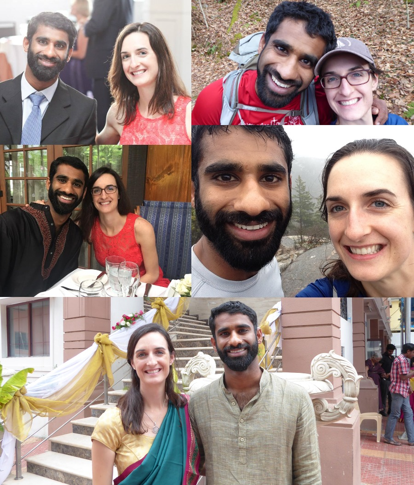

#### INDIA

18 August 2018 / Kochi / Kerala

#### USA

27 May 2018 / Fontana Village / North Carolina

(click the links above for more information)

[french@cherian.net](mailto:french@cherian.net)

### gifts

We value your presence most of all, but should you wish to get us a gift please consider a donation to the [National Parks Foundation](https://www.nationalparks.org/). You may also browse our registries at  [Amazon](https://www.amazon.com/wedding/share/french-cherian) or [Ten Thousand Villages](https://www.tenthousandvillages.com/giftregistry/view/index/id/6935f7dbb76713135f973c35416e3cd7/).
We have also set up a honeymoon fund for our [planned hiking trip in the Himalayas](https://www.honeyfund.com/wedding/FrenchCherian4ever)

<!-- #### GIFTS -->

<!-- We value your presence most of all, but should you wish to get us a gift please consider a donation to the [National Parks Foundation](https://www.nationalparks.org/). You may also browse our registries at  [Amazon](https://www.amazon.com/wedding/share/french-cherian) or [Ten Thousand Villages](https://www.tenthousandvillages.com/giftregistry/view/index/id/6935f7dbb76713135f973c35416e3cd7/). We have also set up a honeymoon fund for our [planned hiking trip in the Himalayas](https://www.honeyfund.com/wedding/FrenchCherian4ever) -->

<!--  -->
<!--   <article class="index-page"> -->
<!--     <h2><a href="{{ post.url | relative_url }}">{{ post.title }}</a></h2> -->
<!--     {{ post.excerpt }} -->
<!--   </article> -->
<!--  -->
